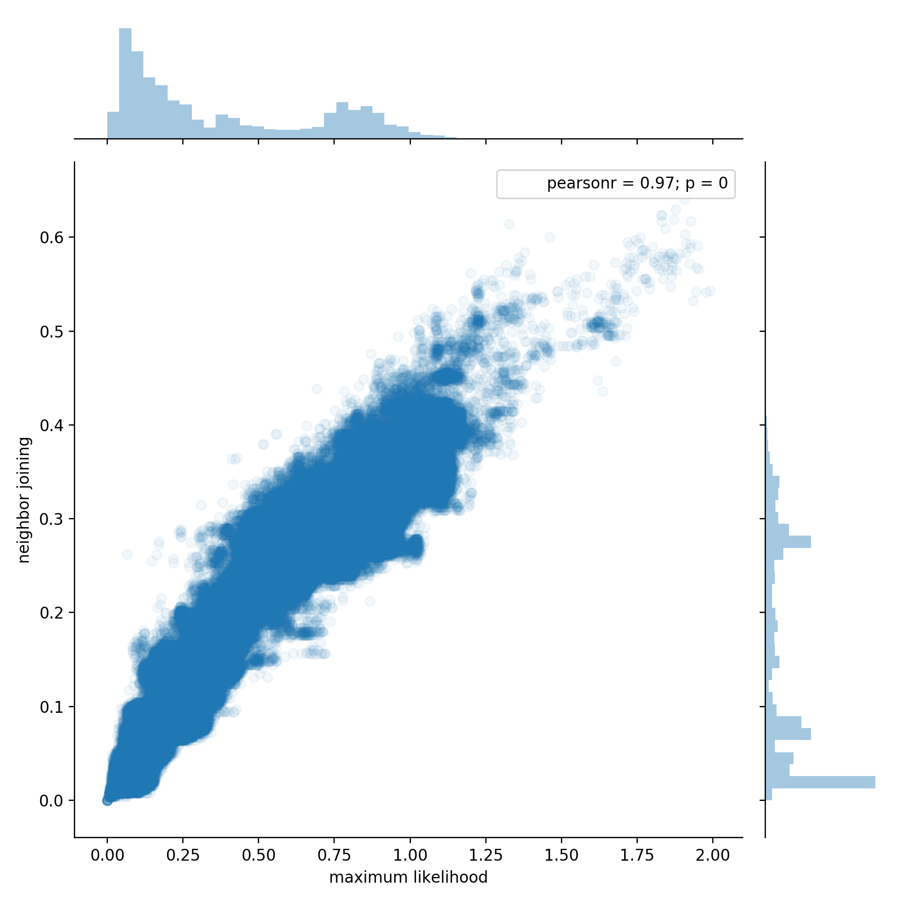

# SuchTree

A Python library for doing fast, thread-safe computations with
phylogenetic trees.

[](https://github.com/ryneches/SuchTree/actions) [](https://codecov.io/gh/ryneches/SuchTree) [](https://raw.githubusercontent.com/ryneches/SuchTree/master/LICENSE) [](http://joss.theoj.org/papers/23bac1ae69cfaf201203dd52d7dd5610)

### So problem

You have a phylogenetic tree, and you want to do some statistics with
it. No problem! There are lots of packages in Python that let you
manipulate phylogenies, like [`dendropy`](http://www.dendropy.org/),
[`scikit-bio`](http://scikit-bio.org/docs/latest/tree.html) and
[`ete3`](http://etetoolkit.org/). Surely one of them will work. And
indeed they will, if your tree isn't *too* big and your statistical
method doesn't require *too* many traversals. If you're working with a
hundred or a thousand organisms, no problem. You should probably
forget about `SuchTree` and use a tree package that has lots of cool
features.

If, however, you are working with trees that include tens of
thousands, or maybe even millions of organisms, you are going to run
into problems. `ete3`, `dendropy` and `scikit-bio`'s `TreeNode` are all
implemented to give you lots of flexibility. You can re-root trees,
use different traversal schemes, attach metadata to nodes, attach and
detach nodes, splice sub-trees into or out of the main tree, and do
lots of other useful things. However, that power and flexibility comes
with a price; speed.

For trees of moderate size, it is possible to solve the speed issue by
working with matrix representations of the tree. Unfortunately, most
representations scale quadratically with the number of taxa in your tree.
A distance matrix for a tree of 100,000 taxa will consume about 20GB 
of RAM. If your method performs sampling, then almost every operation
will be a cache miss. Even if you have the RAM, it will be painfully slow.

### So problem, again

Suppose you have more than one group of organisms, and you want to study
the way their interactions have influenced their evolution. Now, you have
several trees that link together to form a generalized graph. Oh no, not
graph theory!

Calm yourself! `SuchLinkedTrees` has you covered. At the moment,
`SuchLinkedTrees` supports trees of two interacting groups, but work is
under way to generalize it to any number of groups. Like `SuchTree`,
`SuchLinkedTrees` is not intended to be a general purpose graph theory
package. Instead, it leverages `SuchTree` to efficiently handle the 
problem-specific tasks of working with co-phylogeny systems. It will load
your datasets. It will build the graphs. It will let you subset the graphs
using their phylogenetic or ecological properties. It will generate
weighted adjacency and Laplacian matrixes of the whole graph or of subgraphs
you have selected. It will generate spectral decompositions of subgraphs if
spectral graph theory is your thing.

And, if that doesn't solve your problem, it will emit sugraphs as `Graph`
objects for use with the [`igraph`](http://igraph.org/) network analysis
package, or node and edge data for building graphs in [`networkx`](https://networkx.github.io/). Now you can do even more things. Maybe you want to get all crazy
with some [graph kernels](https://github.com/BorgwardtLab/GraphKernels)? Well,
now you can just do that.

### Much solution

`SuchTree` is motivated by the observation that, while a distance
matrix of 100,000 taxa is quite bulky, the tree it represents can be
made to fit into about 7.6MB of RAM if implemented simply using only
`C` primitives.  This is small enough to fit into L3 cache on many
modern microprocessors. This comes at the cost of traversing the tree
for every calculation (about 16 hops from leaf to root for a 100,000
taxa tree), but, as these operations all happen on-chip, the processor
can take full advantage of
[pipelining](https://en.wikipedia.org/wiki/Instruction_pipelining),
[speculative execution](https://en.wikipedia.org/wiki/Speculative_execution)
and other optimizations available in modern CPUs.

### Nice benchmark

Here, we use `SuchTree` to compare the topology of two trees built
from the same 54,327 sequences using two methods : neighbor joining
and Morgan Price's [`FastTree`](http://www.microbesonline.org/fasttree/)
approximate maximum likelihood algorithm. Using a million randomly
chosen pairs of leaf nodes, we look at the patristic distances in each
of the two trees, plot them against one another, and compute
correlation coefficients.

On an Intel i7-3770S, `SuchTree` completes the two million distance
calculations in a little more than ten seconds.

```python
from SuchTree import SuchTree
import random

T1 = SuchTree( 'data/bigtrees/ml.tree' )
T2 = SuchTree( 'data/bigtrees/nj.tree' )

print( 'nodes : %d, leafs : %d' % ( T1.length, len(T1.leafs) ) )
print( 'nodes : %d, leafs : %d' % ( T2.length, len(T2.leafs) ) )
```

```
nodes : 108653, leafs : 54327
nodes : 108653, leafs : 54327
```

```python
N = 1000000
v = list( T1.leafs.keys() )

pairs = []
for i in range(N) :
    pairs.append( ( random.choice( v ), random.choice( v ) ) )

%time D1 = T1.distances_by_name( pairs ); D2 = T2.distances_by_name( pairs )
```

```
CPU times: user 10.1 s, sys: 0 ns, total: 10.1 s
Wall time: 10.1 s
```



```python
from scipy.stats import kendalltau, pearsonr

print( 'Kendall\'s tau : %0.3f' % kendalltau( D1, D2 )[0] )
print( 'Pearson\'s r   : %0.3f' % pearsonr( D1, D2 )[0] )
```
```
Kendall's tau : 0.709
Pearson's r   : 0.969
```

### Many installation

`SuchTree` depends on the following packages :

* `scipy`
* `numpy`
* `dendropy`
* `cython`
* `pandas`

To install the current release, you can install from PyPI :

```
pip install SuchTree
```

To install the most recent development version :

```
git clone https://github.com/ryneches/SuchTree.git
cd SuchTree
./setup.py install
```

### How usage

`SuchTree` will accept either a URL or a file path :

```python
from SuchTre import SuchTree

T = SuchTree( 'test.tree' )
T = SuchTree( 'http://litoria.eeb.yale.edu/bird-tree/archives/PatchClade/Stage2/set1/Spheniscidae.tre' )
```

The available properties are :

* `length` : the number of nodes in the tree
* `depth` : the maximum depth of the tree
* `root` : the id of the root node
* `leafs` : a dictionary mapping leaf names to their ids
* `leafnodes` : a dictionary mapping leaf node ids to leaf names

The available methods are :

* `get_parent` : for a given node id or leaf name, return the parent id
* `get_children` : for a given node id or leaf name, return the ids of
the child nodes (leaf nodes have no children, so their child node ids will
always be -1)
* `get_distance_to_root` : for a given node id or leaf name, return
the integrated phylogenetic distance to the root node
* `mrca` : for a given pair of node ids or leaf names, return the id
of the nearest node that is parent to both
* `distance` : for a given pair of node ids or leaf names, return the
patristic distance between the pair
* `distances` : for an (n,2) array of pairs of node ids, return an (n)
array of patristic distances between the pairs
* `distances_by_name` for an (n,2) list of pairs of leaf names, return
an (n) list of patristic distances between each pair
* `dump_array` : print out the entire tree (for debugging only! May
produce pathologically gigantic output.)

### Very dataset

For analysis of ecological interactions, `SuchTree` is distributed
with a curated collection of several different examples from the
literature. Additionally, a collection of simulated interactions with
various properties, along with an annotated notebook of `Python` code
for generating them, is also included. Interactions are registered in
a JSON object (`data/studies.json`).

#### Host/Parasite

* **gopher-louse** Hafner, M.S. & Nadler, S.A. 1988. *Phylogenetic trees support the coevolution of parasites and their hosts.* Nature 332: 258-259)
* **dove-louse** Dale H. Clayton, Sarah E. Bush, Brad M. Goates, and Kevin P. Johnson. 2003. *Host defense reinforces host–parasite cospeciation.* PNAS. 
* **sedge-smut** Escudero, Marcial. 2015. *Phylogenetic congruence of parasitic
smut fungi (Anthracoidea, Anthracoideaceae) and their host plants (Carex,
Cyperaceae): Cospeciation or host-shift speciation?* American journal of
botany.
* **fish-worm** Maarten P. M. Vanhove, Antoine Pariselle, Maarten Van Steenberge,
Joost A. M. Raeymaekers, Pascal I. Hablützel, Céline Gillardin, Bart Hellemans,
Floris C. Breman, Stephan Koblmüller, Christian Sturmbauer, Jos Snoeks,
Filip A. M. Volckaert & Tine Huyse. 2015. *Hidden biodiversity in an ancient lake: phylogenetic congruence between Lake Tanganyika tropheine cichlids and their monogenean flatworm parasites*, Scientific Reports. 

#### Plant/Pollinator (visitor) interactions

These were originally collected by Enrico Rezende *et al.* :

> Enrico L. Rezende, Jessica E. Lavabre, Paulo R. Guimarães, Pedro Jordano & Jordi Bascompte 
"[Non-random coextinctions in phylogenetically structured mutualistic networks](http://www.nature.com/nature/journal/v448/n7156/abs/nature05956.html)," *Nature*, 2007

* **arr1**	Arroyo, M.T.K., R. Primack & J.J. Armesto. 1982. *Community studies in pollination ecology in the high temperate Andes of central Chile. I. Pollination mechanisms and altitudinal variation.* Amer. J. Bot. 69:82-97.
* **arr2**	Arroyo, M.T.K., R. Primack & J.J. Armesto. 1982. *Community studies in pollination ecology in the high temperate Andes of central Chile. I. Pollination mechanisms and altitudinal variation.* Amer. J. Bot. 69:82-97.
* **arr3**	Arroyo, M.T.K., R. Primack & J.J. Armesto. 1982. *Community studies in pollination ecology in the high temperate Andes of central Chile. I. Pollination mechanisms and altitudinal variation.* Amer. J. Bot. 69:82-97.
* **bahe**	Barrett, S. C. H., and K. Helenurm. 1987. *The Reproductive-Biology of Boreal Forest Herbs.1. Breeding Systems and Pollination.* Canadian Journal of Botany 65:2036-2046.
* **cllo**	Clements, R. E., and F. L. Long. 1923, Experimental pollination. An outline of the ecology of flowers and insects. Washington, D.C., USA, Carnegie Institute of Washington.
* **dihi**	Dicks, LV, Corbet, SA and Pywell, RF 2002. *Compartmentalization in plant–insect flower visitor webs.* J. Anim. Ecol. 71: 32–43
* **dish**	Dicks, LV, Corbet, SA and Pywell, RF 2002. *Compartmentalization in plant–insect flower visitor webs.* J. Anim. Ecol. 71: 32–43
* **dupo**	Dupont YL, Hansen DM and Olesen JM 2003 *Structure of a plant-flower-visitor network in the high-altitude sub-alpine desert of Tenerife, Canary Islands.* Ecography 26:301-310 
* **eol**	Elberling, H., and J. M. Olesen. 1999. *The structure of a high latitude plant-flower visitor system: the dominance of flies.* Ecography 22:314-323.
* **eolz**	Elberling & Olesen unpubl.
* **eski**	Eskildsen et al. unpubl.
* **herr**	Herrera, J. 1988 *Pollination relatioships in southern spanish mediterranean shrublands.* Journal of Ecology 76: 274-287.
* **hock**	Hocking, B. 1968. *Insect-flower associations in the high Arctic with special reference to nectar.* Oikos 19:359-388.
* **inpk**	Inouye, D. W., and G. H. Pyke. 1988. *Pollination biology in the Snowy Mountains of Australia: comparisons with montane Colorado, USA.* Australian Journal of Ecology 13:191-210.
* **kevn**	Kevan P. G. 1970. *High Arctic insect-flower relations: The interrelationships of arthropods and flowers at Lake Hazen, Ellesmere Island, Northwest Territories, Canada.* Ph.D. thesis, University of Alberta, Edmonton, 399 pp.
* **kt90**	Kato, M., Kakutani, T., Inoue, T. and Itino, T. (1990). *Insect-flower relationship in the primary beech forest of Ashu, Kyoto: An overview of the flowering phenology and the seasonal pattern of insect visits.* Contrib. Biol. Lab., Kyoto, Univ., 27, 309-375.
* **med1**	Medan, D., N. H. Montaldo, M. Devoto, A. Mantese, V. Vasellati, and N. H. Bartoloni. 2002. *Plant-pollinator relationships at two altitudes in the Andes of Mendoza, Argentina.* Arctic Antarctic and Alpine Research 34:233-241.
* **med2**	Medan, D., N. H. Montaldo, M. Devoto, A. Mantese, V. Vasellati, and N. H. Bartoloni. 2002. *Plant-pollinator relationships at two altitudes in the Andes of Mendoza, Argentina.* Arctic Antarctic and Alpine Research 34:233-241.
* **memm**	Memmott J. 1999. *The structure of a plant-pollinator food web.* Ecology Letters 2:276-280.
* **moma**	Mosquin, T., and J. E. H. Martin. 1967. *Observations on the pollination biology of plants on Melville Island, N.W.T., Canada.* Canadian Field Naturalist 81:201-205.
* **mott**	Motten, A. F. 1982. *Pollination Ecology of the Spring Wildflower Community in the Deciduous Forests of Piedmont North Carolina.* Doctoral Dissertation thesis, Duke University, Duhram, North Carolina, USA; Motten, A. F. 1986. Pollination ecology of the spring wildflower community of a temperate deciduous forest. Ecological Monographs 56:21-42.
* **mull**	McMullen 1993
* **oflo**	Olesen unpubl.
* **ofst**	Olesen unpubl.
* **olau**	Olesen unpubl.
* **olle**	Ollerton, J., S. D. Johnson, L. Cranmer, and S. Kellie. 2003. *The pollination ecology of an assemblage of grassland asclepiads in South Africa.* Annals of Botany 92:807-834.
* **perc**	Percival, M. 1974. *Floral ecology of coastal scrub in sotheast Jamaica.* Biotropica, 6, 104-129.
* **prap**	Primack, R.B. 1983. *Insect pollination in the New Zealand mountain flora.* New Zealand J. Bot. 21, 317-333, AB.
* **prca**	Primack, R.B. 1983. *Insect pollination in the New Zealand mountain flora.* New Zealand J. Bot. 21, 317-333. Cass
* **prcg**	Primack, R.B. 1983. *Insect pollination in the New Zealand mountain flora.* New Zealand J. Bot. 21, 317-333. Craigieb.
* **ptnd**	Petanidou, T. 1991. *Pollination ecology in a phryganic ecosystem.* Unp. PhD. Thesis, Aristotelian University, Thessaloniki.
* **rabr**	Ramirez, N., and Y. Brito. 1992. *Pollination Biology in a Palm Swamp Community in the Venezuelan Central Plains.* Botanical Journal of the Linnean Society 110:277-302.
* **rmrz**	Ramirez, N. 1989. *Biología de polinización en una comunidad arbustiva tropical de la alta Guyana Venezolana.* Biotropica 21, 319-330.
* **schm**	Schemske, D. W., M. F. Willson, M. N. Melampy, L. J. Miller, L. Verner, K. M. Schemske, and L. B. Best. 1978. *Flowering Ecology of Some Spring Woodland Herbs.* Ecology 59:351-366.
* **smal**	Small, E. 1976. *Insect pollinators of the Mer Bleue peat bog of Ottawa.* Canadian Field Naturalist 90:22-28. 
* **smra**	Smith-Ramírez C., P. Martinez, M. Nuñez, C. González and J. J. Armesto 2005 *Diversity, flower visitation frequency and generalism of pollinators in temperate rain forests of Chiloé Island,Chile.* Botanical Journal of the Linnean Society, 2005, 147, 399–416.

#### Frugivory interactions

* **bair**	Baird, J.W. 1980. *The selection and use of fruit by birds in an eastern forest.* Wilson Bulletin 92: 63-73.
* **beeh**	Beehler, B. 1983. *Frugivory and polygamy in birds of paradise.* Auk, 100: 1-12.
* **cacg**	Carlo et al. 2003. *Avian fruit preferences across a Puerto Rican forested landscape: pattern consistency and implications for seed removal.* Oecologia 134: 119-131
* **caci**	Carlo et al. 2003. *Avian fruit preferences across a Puerto Rican forested landscape: pattern consistency and implications for seed removal.* Oecologia 134: 119-131
* **caco**	Carlo et al. 2003. *Avian fruit preferences across a Puerto Rican forested landscape: pattern consistency and implications for seed removal.* Oecologia 134: 119-131
* **cafr**	Carlo et al. 2003. *Avian fruit preferences across a Puerto Rican forested landscape: pattern consistency and implications for seed removal.* Oecologia 134: 119-131
* **crom**	Crome, F.H.J. 1975. *The ecology of fruit pigeons in tropical Northern Queensland.* Australian Journal of Wildlife Research, 2: 155-185.
* **fros**	Frost, P.G.H. 1980. *Fruit-frugivore interactions in a South African coastal dune forest.* Pages 1179-1184 in: R. Noring (ed.). Acta XVII Congresus Internationalis Ornithologici, Deutsches Ornithologische Gessenshaft, Berlin.
* **gen1**	Galetti, M., Pizo, M.A. 1996. *Fruit eating birds in a forest fragment in southeastern Brazil.* Ararajuba, Revista Brasileira de Ornitologia, 4: 71-79.
* **gen2**	Galetti, M., Pizo, M.A. 1996. *Fruit eating birds in a forest fragment in southeastern Brazil.* Ararajuba, Revista Brasileira de Ornitologia, 4: 71-79.
* **hamm**	Hammann, A. & Curio, B. 1999. *Interactions among frugivores and fleshy fruit trees in a Philippine submontane rainforest*
* **hrat**	Jordano P. 1985. *El ciclo anual de los paseriformes frugívoros en el matorral mediterráneo del sur de España: importancia de su invernada y variaciones interanuales.* Ardeola, 32, 69-94.
* **kant**	Kantak, G.E. 1979. *Observations on some fruit-eating birds in Mexico.* Auk, 96: 183-186.
* **lamb**	Lambert F. 1989. *Fig-eating by birds in a Malaysian lowland rain forest.* J. Trop. Ecol., 5, 401-412.
* **lope**	Tutin, C.E.G., Ham, R.M., White, L.J.T., Harrison, M.J.S. 1997. *The primate community of the Lopé Reserve, Gabon: diets, responses to fruit scarcity, and effects on biomass.* American Journal of Primatology, 42: 1-24.
* **mack**	Mack, AL and Wright, DD. 1996. *Notes on occurrence and feeding of birds at Crater Mountain Biological Research Station, Papua New Guinea.* Emu 96: 89-101. 
* **mont**	Wheelwright, N.T., Haber, W.A., Murray, K.G., Guindon, C. 1984. *Tropical fruit-eating birds and their food plants: a survey of a Costa Rican lower montane forest.* Biotropica, 16: 173-192.
* **ncor**	P. Jordano, unpubl.
* **nnog**	P. Jordano, unpubl.
* **sapf**	Noma, N. 1997. *Annual fluctuations of sapfruits production and synchronization within and inter species in a warm temperate forest on Yakushima Island, Japan.* Tropics, 6: 441-449.
* **snow**	Snow, B.K., Snow, D.W. 1971. *The feeding ecology of tanagers and honeycreepers in Trinidad.* Auk, 88: 291-322.
* **wes**	Silva, W.R., P. De Marco, E. Hasui, and V.S.M. Gomes, 2002. *Patterns of fruit-frugivores interactions in two Atlantic Forest bird communities of South-eastern Brazil: implications for conservation.* Pp. 423-435. In: D.J. Levey, W.R. Silva and M. Galetti (eds.) Seed dispersal and frugivory: ecology, evolution and conservation. Wallinford: CAB International.
* **wyth**	Snow B.K. & Snow D.W. 1988. *Birds and berries, Calton, England.*


### Wow

Special thanks to [@camillescott](https://github.com/camillescott) and 
[@pmarkowsky](https://github.com/pmarkowsky) for their many helpful
suggestions (and for their patience).

