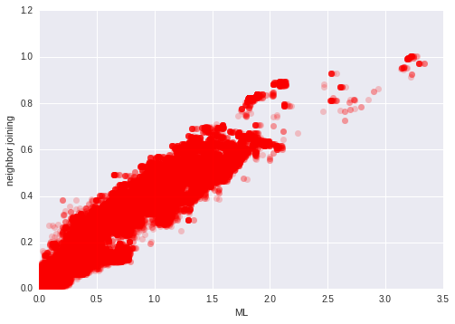

# Summary

Python has several packages for working with phylogenetic trees, each focused on somewhat different aspects of the field. Some of the more active projects include :

* [`DendroPy`](https://www.dendropy.org/), a multi-purpose package for reading, writing, manipulating, simulating and analyzing phylogenetic trees in Python [@dendropy]
* [`ete3`](http://etetoolkit.org/), a package for analysis and visualization of phylogenetic trees with Python or command line tools [@ete3]
* [`Pylogeny`](https://peerj.com/articles/cs-9/), an analytical tool for reshaping and scoring trees with GPU support via the [`BEAGLE`](https://github.com/beagle-dev/beagle-lib) library [@phylogeny]
* The [`Bio.Phylo`](http://dx.doi.org/10.1186/1471-2105-13-209) subpackage in [biopython](http://biopython.org/) collects useful tools for working with common (and not so common) file formats in phylogenetics, along with utilities for analysis and visualization [@biophylo]
* The [`skbio.tree`](http://scikit-bio.org/docs/latest/tree.html) module in [`scikit-bio`](http://scikit-bio.org/) is a base class for phylogenetic trees providing analytical and file processing functions for working with phylogenetic trees [@skbio]

Each of these packages allow trees to be manipulated, edited and reshaped. To make this possible, they must strike a balance between raw performance and flexibility, and most prioritize flexibility and a rich set of features. This is desireable for most use cases, but computational scaling challenges arise when using these packages to work with very large trees. Trees representing microbial communities may contain tens of thousands to tens of millions of taxa, depending on the community diversity and the survey methodology. 

`SuchTree` is designed purely as a backend for analysis of large trees. Significant advantages in memory layout, parallelism and speed are achieved by sacrificing the ability to manipulate, edit or reshape trees (these capabilities exist in other packages). It scales to millions of taxa, and the key algorithms and data structures permit concurrent threads without locks. 

**Figure 1 :** Two phylogenetic trees of 54,327 taxa were constructed using different methods (approximate maximum likelihood using [`FastTree`](http://www.microbesonline.org/fasttree/) [@price2009fasttree,@price2010fasttree] and the [`neighbor joining`](https://en.wikipedia.org/wiki/Neighbor_joining) agglomerative clustering method). To explore the different topologies of the trees, pairs of taxa were chosen at random and the patristic distance between each pair was computed through each of the two trees. This plot shows 1,000,000 random pairs sampled from 1,475,684,301 possible pairs (0.07%). The two million distances calculations required about 12.5 seconds using a single thread.

`SuchTree` supports co-phylogenies, with functions for efficiently extracting graphs and subgraphs for network analysis, and has native support for [`igraph`](http://igraph.org/) and [`networkx`](https://networkx.github.io/).

In addition to the software itself, the repository includes a collection of 51 curated co-phylogenies gathered from the literature grouped into three categories by the type of ecology (frugivory, parasitism and pollination), and two collections of simulated co-phylogenies grouped by the type of simulation (independent evolution and perfect coevolution).

# References
